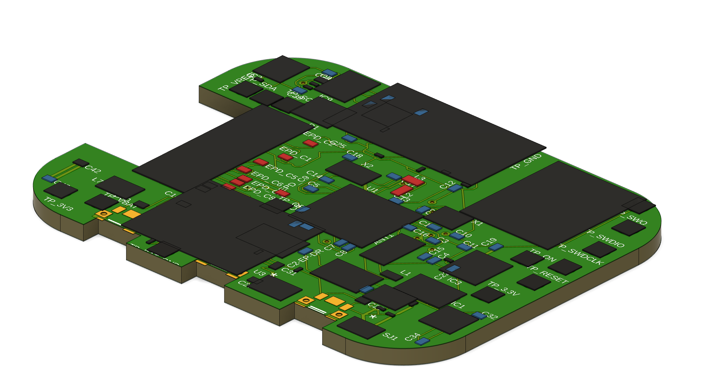
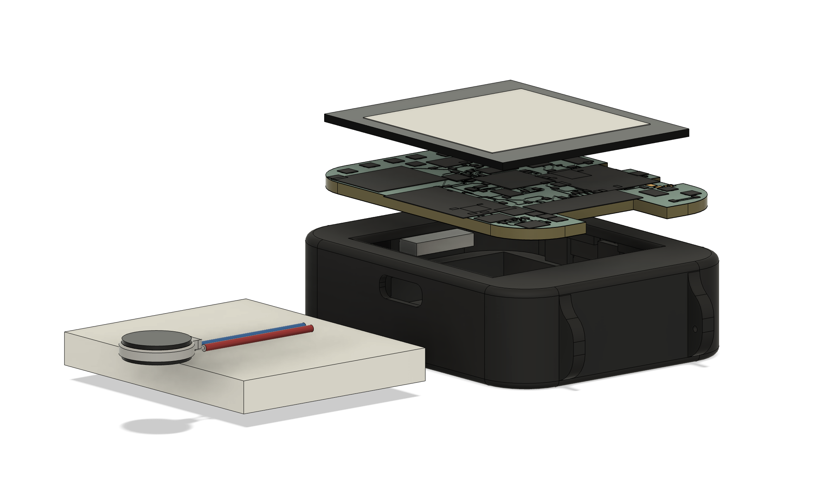
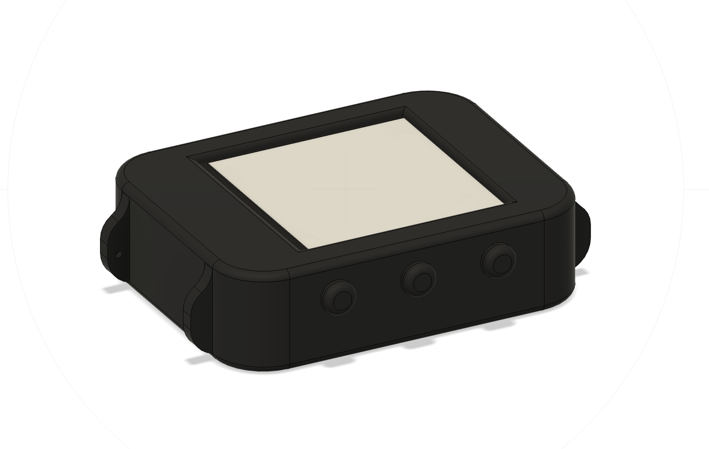

# InkTime — Open Source E-Paper Smartwatch

> Smartwatch open-source cu display e-paper, bazat pe nRF52840 SoC cu Bluetooth 5.0.

---

## Block Diagram

```
                    ┌─────────────────────────────────────────────────┐
                    │               nRF52840 (MCU)                    │
                    │          ARM Cortex-M4F @ 64MHz                 │
                    │        1MB Flash | 256KB RAM | BLE 5.0          │
                    └──┬──────────┬──────────┬──────────┬─────────────┘
                       │ SPI      │ I²C      │ GPIO     │ SWD
          ┌────────────┘          │          │          └──────────────┐
          ▼                       ▼          ▼                         ▼
  E-Paper Display         ┌──────────┐   Butoane (x3)           Debug Header
  WSH-12561 1.54"         │ I²C Bus  │   SW_UP / SW_ENT          (SWO/SWDIO
  200x200px               │ SCL/SDA  │   SW_DN                    /SWDCLK)
                          └──┬───┬───┘
                             │   │
                    ┌────────┘   └────────┐
                    ▼                     ▼
                BMA423               MAX17048
               (IMU/Step)           (Fuel Gauge)
                + DRV2605             + BQ25180
               (Haptic)              (Charger)

                    ┌──────────────────────────────────────┐
                    │          Power Management            │
                    │  USB-C ──► BQ25180 ──► AKY0106      │
                    │          (Charger)   (LiPo 400mAh)  │
                    │              │                       │
                    │              ▼                       │
                    │      RT6160AWSC (DC/DC)              │
                    │      VIN→3.3V (TP_3V3)               │
                    │      + EPD_3V3 rail separat          │
                    └──────────────────────────────────────┘
```

---

## Bill of Materials (BOM)

| Ref | Componentă | Package | Descriere | JLC Parts | Datasheet |
|-----|------------|---------|-----------|-----------|-----------|
| U1 | nRF52840-QIAA | QFN73 | MCU BLE 5.0, ARM Cortex-M4F, 1MB Flash | [C190794](https://jlcpcb.com/parts/componentSearch?isSearch=true&searchTxt=nRF52840) | [Datasheet](https://infocenter.nordicsemi.com/pdf/nRF52840_PS_v1.7.pdf) |
| U2 | RT6160AWSC | SOT-23-6 | DC/DC Step-Down 600mA, 3.3V | [C89358](https://jlcpcb.com/parts/componentSearch?isSearch=true&searchTxt=RT6160AWSC) | [Datasheet](https://www.richtek.com/assets/product_file/RT6160A/DS6160A-02.pdf) |
| U3 | MAX17048G+T10 | SOT-23-5 | LiPo Fuel Gauge, I²C 0x36 | [C112596](https://jlcpcb.com/parts/componentSearch?isSearch=true&searchTxt=MAX17048G) | [Datasheet](https://datasheets.maximintegrated.com/en/ds/MAX17048-MAX17049.pdf) |
| U4 | BMA423 | LGA-12 | IMU 3-axis Accel + Step Counter, I²C 0x18 | [C362551](https://jlcpcb.com/parts/componentSearch?isSearch=true&searchTxt=BMA423) | [Datasheet](https://www.bosch-sensortec.com/media/boschsensortec/downloads/datasheets/bst-bma423-ds000.pdf) |
| U5 | BQ25180YBGR | DSBGA-9 | LiPo Charger 350mA, I²C 0x6B | [C2682195](https://jlcpcb.com/parts/componentSearch?isSearch=true&searchTxt=BQ25180) | [Datasheet](https://www.ti.com/lit/ds/symlink/bq25180.pdf) |
| U6 | DRV2605YFRI | DSBGA-12 | Haptic Driver I²C pentru motor vibratie | [C2678581](https://jlcpcb.com/parts/componentSearch?isSearch=true&searchTxt=DRV2605) | [Datasheet](https://www.ti.com/lit/ds/symlink/drv2605.pdf) |
| DSP1 | WSH-12561 | FPC 24-pin | E-Paper Display 1.54", 200×200px, SPI | — | [Datasheet](https://www.tme.eu/Document/0ca57a8ffbcd57b5bca53252eb9d6ec3/WSH-12561.pdf) |
| BAT1 | AKY0106 | — | LiPo 3.7V 400mAh | — | [Datasheet](https://www.tme.eu/Document/b9e12bf26ad0ba929a22ab5d58f022cd/AKY0106.pdf) |
| J1 | USB Type-C 16P | — | Conector USB-C + ESD (USBLC6-2SC6Y) | — | — |
| SW1 | SW_UP | — | Buton tactil sus | — | — |
| SW2 | SW_ENT | — | Buton tactil enter | — | — |
| SW3 | SW_DN | — | Buton tactil jos | — | — |
| X2 | Crystal 32.768kHz | — | RTC crystal low-power | — | — |
| L5 | Inductor 68µH | — | E-Paper drive circuit | — | — |
| L1 | Inductor 3.9nH | — | Matching antena BLE | — | — |

---

## Hardware Functionality

### Microcontroller — nRF52840
Inima dispozitivului este **nRF52840** (Nordic Semiconductor), ARM Cortex-M4F @ 64MHz cu Bluetooth 5.0 integrat, 1MB Flash și 256KB RAM. Antena BLE este plasată pe extensia dedicată a PCB-ului (proeminența din colțul din dreapta sus), cu cutout complet sub ea, fără plane de masă și fără trasee rutate în acea zonă. Un inductor de matching de 3.9nH (L1) asigură adaptarea de impedanță a antenei.

### Display E-Paper — WSH-12561
- **Interfață:** SPI (P0.02=SCK, P0.03=MOSI, P0.04=EPD_CS, P0.05=EPD_DC) + GPIO (P0.06=EPD_RST, EPD_BUSY)
- **Rezoluție:** 200×200 px, 1.54 inch, monocrom bistabil
- **Alimentare:** EPD_3V3 — rail separat generat de DC/DC
- **Circuit drive dedicat:** bobină 68µH + diode Schottky MBR0530 + tranzistor SI1308EDL-T1-GE3
- **Consum:** ~0 µA standby (bistabil), ~26mW la refresh

### IMU — BMA423
- **Interfață:** I²C, adresă 0x18, pe bus-ul shared SDA (P0.26) / SCL (P0.27)
- **Funcții:** accelerometru 3-axis ±2–16g, pedometru hardware, wrist-tilt detection
- **IMU_INT1 / IMU_INT2** conectați la GPIO-uri nRF pentru wake-on-motion și step counter

### Fuel Gauge — MAX17048
- **Interfață:** I²C, adresă 0x36, pe bus-ul shared SDA/SCL
- **ALERT** conectat la **P0.09** pe nRF pentru notificări nivel baterie scăzut
- Algoritm ModelGauge — estimează SoC fără rezistor de sensing extern

### Battery Charger — BQ25180
- **Interfață:** I²C, adresă 0x6B, pe bus-ul shared SDA/SCL
- **PMIC_INT** conectat la **P0.11** pentru notificări charger
- Input: USB-C VBUS 5V → LiPo 3.7V, curent 350mA programabil

### DC/DC Converter — RT6160AWSC
- Step-Down sincron: VREG → 3.3V (TP_3V3), curent max 600mA, eficiență >90%
- SCL/SDA pentru ajustarea programabilă a tensiunii prin I²C
- EPD_3V3 generat ca rail separat pentru display

### Haptic Driver — DRV2605YFRI
- **Interfață:** I²C pe bus-ul shared + **HAPTIC_EN** (P0.12)
- Ieșiri JP_OP / JP_ON pentru motor vibratie LRA/ERM
- 123 efecte haptic integrate în hardware

---

## nRF52840 Pin Assignment

| Pin nRF | Net/Semnal | Componentă | Justificare |
|---------|-----------|------------|-------------|
| P0.00/XL1 | XL1 | Crystal 32.768kHz | RTC low-power clock |
| P0.01/XL2 | XL2 | Crystal 32.768kHz | RTC low-power clock |
| P0.02 | EPD_SCK | E-Paper SPI | SPI clock display |
| P0.03 | EPD_MOSI | E-Paper SPI | SPI data display |
| P0.04/AIN2 | EPD_CS | E-Paper | Chip select display |
| P0.05/AIN3 | EPD_DC | E-Paper | Data/Command select |
| P0.06 | EPD_RST | E-Paper | Reset hardware display |
| P0.07 | EPD_BUSY | E-Paper | Input: display ocupat |
| P0.08 | HAPTIC_EN | DRV2605 | Enable haptic driver |
| P0.09/NFC1 | ALERT | MAX17048 | Interrupt fuel gauge |
| P0.11 | PMIC_INT | BQ25180 | Interrupt charger |
| P0.12 | IMU_INT1 | BMA423 | Wake-on-motion interrupt |
| P0.13 | SW_UP | Buton sus | Input GPIO pull-up |
| P0.14 | SW_ENT | Buton enter | Input GPIO pull-up |
| P0.15 | SW_DN | Buton jos | Input GPIO pull-up |
| P0.16 | IMU_INT2 | BMA423 | Step counter interrupt |
| P0.18/RESET | RESET | — | Reset hardware MCU |
| P0.26 | SDA | I²C bus shared | Date I²C (toți senzorii) |
| P0.27 | SCL | I²C bus shared | Clock I²C |
| SWDIO | SWDIO | Debug Header | SWD programare/debug |
| SWDCLK | SWDCLK | Debug Header | SWD clock |
| SWO | SWO | Debug Header | SWD trace output |
| VBUS | VBUS | USB-C | Detecție alimentare USB |

---

## Power Budget

| Componentă | Activ | Sleep |
|------------|-------|-------|
| nRF52840 | ~7 mA | ~2 µA (System OFF) |
| E-Paper refresh | ~7 mA (impuls ~2s) | 0 µA (bistabil) |
| BMA423 | ~150 µA | ~2 µA |
| MAX17048 | ~23 µA | ~3 µA |
| BQ25180 | ~50 µA | ~18 µA |
| DRV2605 + Motor | ~100 mA (impuls scurt) | 0 µA |
| RT6160 quiescent | ~55 µA | ~55 µA |
| **Total uz normal** | **~10–15 mA** | — |
| **Total deep sleep** | — | **~30 µA** |

**Baterie:** AKY0106 — 3.7V, 400mAh
- Uz normal (BLE activ, refresh 1/min): ~400mAh ÷ 12mA ≈ **~33 ore**
- Deep sleep (refresh rar, BLE advertising): ~400mAh ÷ 0.5mA ≈ **~33 zile**

---

## PCB Design Notes

- **Straturi:** 2 (TOP + BOTTOM), grosime PCB **1mm**
- **Plan de masă** pe ambele straturi
- **Trasee putere:** min. 0.3mm | **Trasee date:** min. 0.15mm
- **Antena nRF52840:** extensie dedicată PCB, cutout sub antenă, fără masă/trasee în zonă
- **Via stitching** între planurile de masă, în special în zona radio
- **Condensatoare decuplare 100nF** lângă pinii VDD ai fiecărui IC
- **Fără unghiuri de 90°** în trasee
- Toate componentele exclusiv pe **layer TOP**

---

## Images

### PCB 3D Render


### Exploded View


### Device Render


---

## Design Log

- **RT6160AWSC:** ales pentru eficiență la curenți mici și tensiune programabilă I²C
- **DRV2605:** 123 efecte haptic hardware fără firmware complex, suportă LRA și ERM
- **E-Paper drive circuit:** bobină 68µH + MBR0530 + SI1308EDL pentru VCOM negativ
- **Antena BLE:** extensie PCB dedicată, matching network L1=3.9nH pentru 50Ω
- **Crystal 32.768kHz:** RTC extern pentru low-power timekeeping precis
- **Bateria** conectată direct la TP_VBAT / TP_BAT_GND fără conector JST

---

## License

Distributed under the [MIT License](LICENSE).